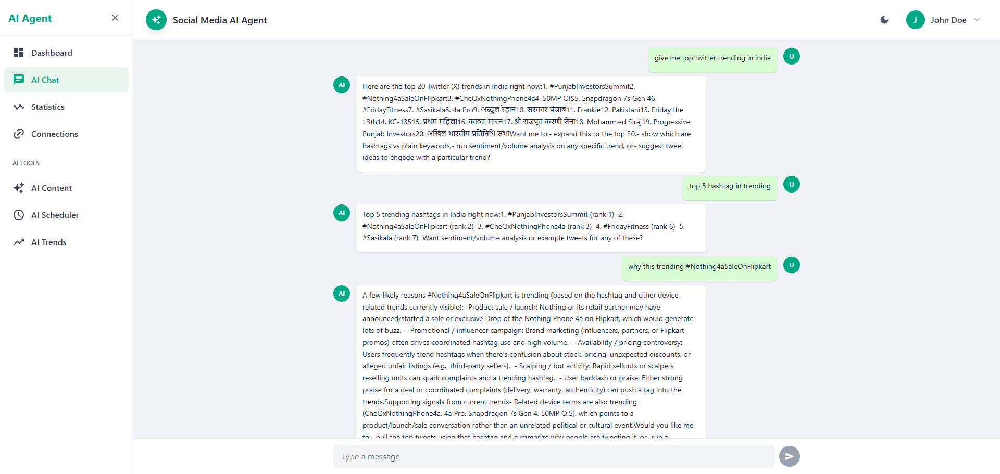
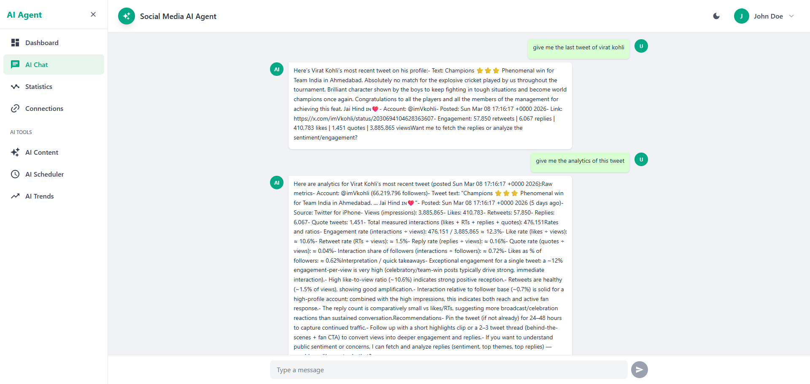
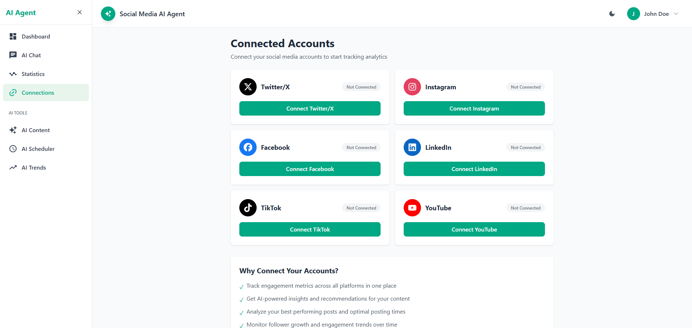
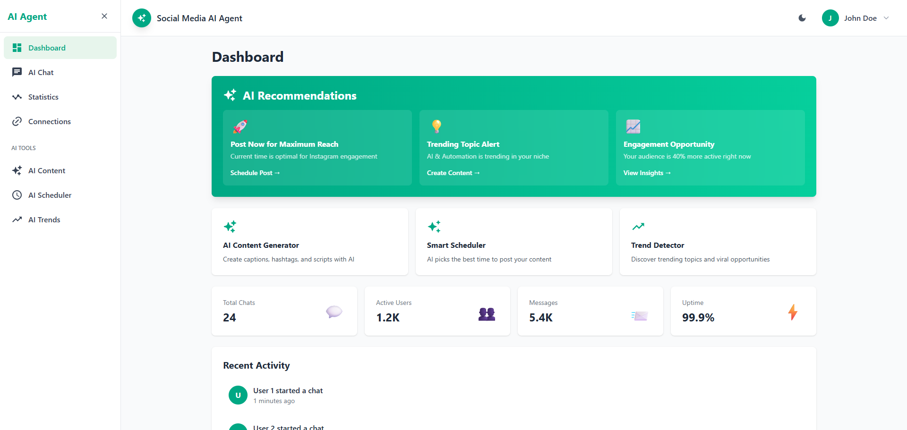

# Social Media AI Agent

An AI-powered social media analytics and management platform that helps users optimize their social media presence across multiple platforms.

## 🚀 Overview

Social Media AI Agent is a comprehensive platform that connects to your social media accounts (Twitter/X, Instagram, Facebook, LinkedIn, TikTok, YouTube) and provides AI-powered insights, content generation, and scheduling capabilities.

## ✨ Key Features

### 1. **AI Chat Assistant**

- Real-time conversational AI for social media strategy
- Ask questions about your performance and get instant insights
- Streaming responses with markdown support

### 2. **Multi-Platform Analytics**

- Unified dashboard for all social media platforms
- Track engagement, followers, and performance metrics
- Platform-specific insights and comparisons
- AI-generated recommendations based on your data

### 3. **AI Content Generator**

- Generate captions, hashtags, video scripts, and descriptions
- Platform-specific content optimization
- Multiple tone options (professional, casual, funny, inspirational)
- Copy and regenerate functionality

### 4. **AI Smart Scheduler**

- AI-powered optimal posting time recommendations
- Schedule posts across multiple platforms
- Performance prediction scores
- Automated posting at peak engagement times

### 5. **AI Trend Detector**

- Real-time trending topics in your niche
- Viral hashtag opportunities
- Content suggestions based on trends
- Relevance scoring for your audience

### 6. **Connected Accounts Management**

- Easy OAuth integration with social platforms
- Manage multiple accounts from one dashboard
- Refresh data on demand
- Secure token storage

## 🎯 Why Connect Your Social Media Accounts?

### **Get Your Data Analyzed**

Without connecting your accounts, we can't access your posts, engagement metrics, or follower data. Connection gives us permission to:

- Read your posts and performance metrics
- Analyze engagement patterns
- Track follower growth
- Monitor content performance

### **Use AI-Powered Features**

- **AI Chat**: Ask "Why is my Instagram engagement low?" - AI needs your data to answer
- **AI Insights**: Generate personalized recommendations based on YOUR content
- **AI Scheduler**: Post on your behalf at optimal times
- **AI Trends**: Analyze YOUR content to suggest relevant trends

### **All-in-One Convenience**

Instead of checking analytics on each platform separately:

- ❌ Open Instagram → check analytics
- ❌ Open Twitter → check analytics
- ❌ Open Facebook → check analytics

With our platform:

- ✅ Open ONE dashboard → see ALL analytics
- ✅ Get AI insights across all platforms
- ✅ Compare performance side-by-side

### **AI-Powered Automation**

- Auto-schedule posts at optimal times
- Auto-generate content ideas
- Get real-time engagement alerts
- Automated performance reports

### **Better Than Native Analytics**

- Instagram/Twitter analytics are basic
- Our AI provides **deeper insights** and **actionable recommendations**
- Cross-platform comparison (which platform performs better?)
- Predictive analytics (what content will perform best?)

### **Real-World Example**

**Without Connection**: You only see demo data, can't use AI features

**With Connection**:

1. Connect your Instagram account
2. We fetch your last 100 posts
3. AI analyzes: "Your reels get 5x more views than photos. Post more reels!"
4. You ask AI: "What should I post tomorrow?"
5. AI suggests: "Post a reel about [trending topic] at 2 PM for maximum engagement"

**The Value**: Get AI-powered insights you can't get from Instagram alone.

## 🛠️ Tech Stack

### Frontend

- **React 19** with TypeScript
- **Vite** for fast development
- **Tailwind CSS v4** for styling
- **React Router** for navigation
- **Recharts** for data visualization
- **React Markdown** for rich text rendering
- **Server-Sent Events (SSE)** for real-time AI streaming

### Backend

- **Express.js** with TypeScript
- **OpenAI Agents** for AI capabilities
- **SSE** for streaming responses
- **OAuth 2.0** for social media authentication (to be implemented)

### Design

- WhatsApp-inspired UI with green theme (#00a884)
- Light/Dark mode support
- Fully responsive design
- Collapsible sidebar navigation

## 📦 Installation

### Prerequisites

- Node.js 18+
- pnpm (recommended) or npm

### Frontend Setup

```bash
cd frontend
pnpm install
pnpm dev
```

Frontend runs on `http://localhost:4000`

### Backend Setup

```bash
cd backend
npm install
npm run dev
```

Backend runs on `http://localhost:3000`

## 🎨 Features Breakdown

### Dashboard

- AI recommendations banner with real-time suggestions
- Quick access to AI tools
- Stats overview
- Recent activity feed

### Statistics Page

- Platform selector (All, Twitter, Instagram, Facebook, LinkedIn, TikTok, YouTube)
- Engagement trends charts
- Top performing posts
- Platform comparison
- AI-powered insights section

### Connections Page

- Connect/disconnect social media accounts
- View connection status
- Refresh data functionality
- Benefits explanation

### AI Tools

- **Content Generator**: Create captions, hashtags, scripts
- **Smart Scheduler**: Schedule posts with AI recommendations
- **Trend Detector**: Discover trending topics and viral opportunities

## 🔐 Security & Privacy

- OAuth 2.0 for secure authentication
- Access tokens stored securely
- No password storage
- Users can disconnect accounts anytime
- Data fetched only with explicit permission

## 🚧 Roadmap

- [ ] Implement real OAuth integration for all platforms
- [ ] Add database for user data storage
- [ ] Implement real-time data fetching from social media APIs
- [ ] Add AI-powered comment reply suggestions
- [ ] Implement competitor analysis
- [ ] Add team collaboration features
- [ ] Mobile app development
- [ ] Advanced analytics and reporting

## 📄 License

MIT License

## 🤝 Contributing

Contributions are welcome! Please feel free to submit a Pull Request.

## 📧 Support

For support, email support@socialmediaai.com or open an issue in the repository.

   
